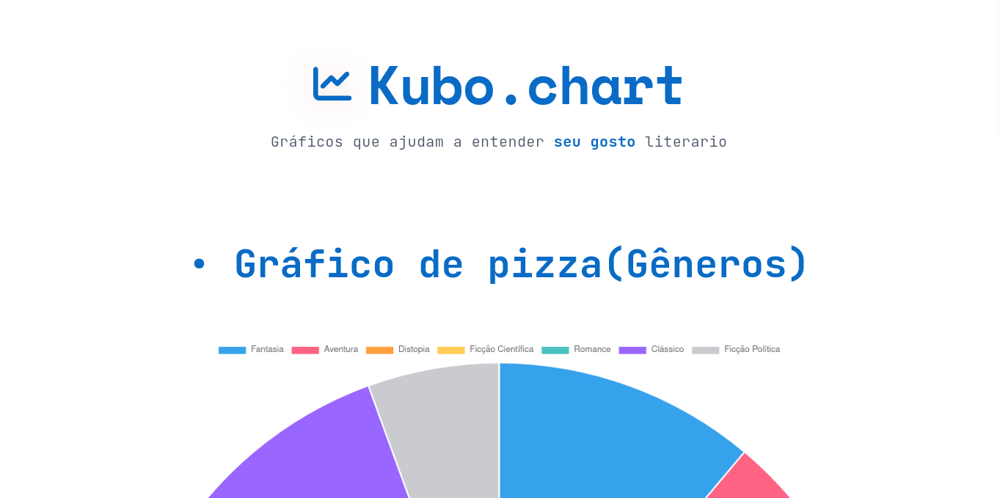

# Trabalho Prático - Semana 14

A partir dos dados disponíveis em seu projeto, vamos explorar formas de visualização que permitam apresentar essas informações de maneira clara, interativa e significativa. Você poderá utilizar gráficos (barras, linhas, pizza), mapas, calendários ou outras formas de visualização. Seu desafio é desenvolver uma página Web capaz de organizar, processar e exibir os dados de forma compreensível e visualmente atraente.

Com base no tipo de projeto escolhido, você deverá propor **visualizações que estimulem a interpretação, o agrupamento e a apresentação criativa dos dados**, trabalhando tanto os aspectos lógicos quanto os visuais da aplicação.

Sugerimos o uso das seguintes ferramentas acessíveis: [FullCalendar](https://fullcalendar.io/), [Chart.js](https://www.chartjs.org/), [Mapbox](https://docs.mapbox.com/api/), para citar algumas.

## Informações Gerais

- Nome: Matheus Felipe Costa William
- Matrícula: 927495
- Proposta de projeto escolhida: Biblioteca Digital
- Breve descrição sobre seu projeto: Um biblitoeca digital com livros selecionados pelo usuário

**Print da tela com a implementação**

Realizei a criação de dois gráficos com base no banco de dados fornecido. Os gráficos constam, em ordem, a quantidade de livros por gênero em um gráfico de pizza, e o outro consta a nota de cada livro em um gráfico de barra.

